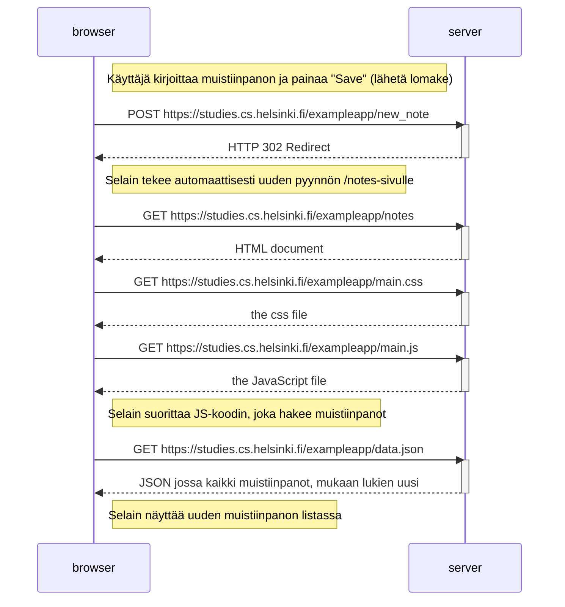

```mermaid
sequenceDiagram
participant browser
participant server

    Note right of browser: Käyttäjä kirjoittaa muistiinpanon ja painaa "Save" (lähetä lomake)

    browser->>server: POST https://studies.cs.helsinki.fi/exampleapp/new_note
    activate server
    server-->>browser: HTTP 302 Redirect
    deactivate server

    Note right of browser: Selain tekee automaattisesti uuden pyynnön /notes-sivulle

    browser->>server: GET https://studies.cs.helsinki.fi/exampleapp/notes
    activate server
    server-->>browser: HTML document
    deactivate server

    browser->>server: GET https://studies.cs.helsinki.fi/exampleapp/main.css
    activate server
    server-->>browser: the css file
    deactivate server

    browser->>server: GET https://studies.cs.helsinki.fi/exampleapp/main.js
    activate server
    server-->>browser: the JavaScript file
    deactivate server

    Note right of browser: Selain suorittaa JS-koodin, joka hakee muistiinpanot

    browser->>server: GET https://studies.cs.helsinki.fi/exampleapp/data.json
    activate server
    server-->>browser: JSON jossa kaikki muistiinpanot, mukaan lukien uusi
    deactivate server

    Note right of browser: Selain näyttää uuden muistiinpanon listassa
```
