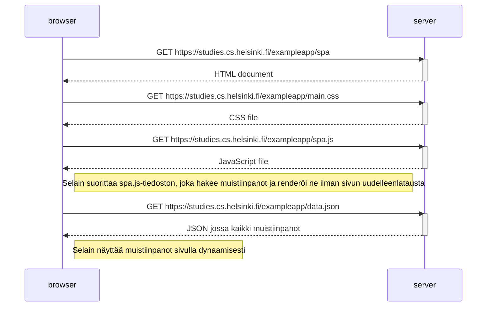

```mermaid
sequenceDiagram
participant browser
participant server


    browser->>server: GET https://studies.cs.helsinki.fi/exampleapp/spa
    activate server
    server-->>browser: HTML document
    deactivate server

    browser->>server: GET https://studies.cs.helsinki.fi/exampleapp/main.css
    activate server
    server-->>browser: CSS file
    deactivate server

    browser->>server: GET https://studies.cs.helsinki.fi/exampleapp/spa.js
    activate server
    server-->>browser: JavaScript file
    deactivate server

    Note right of browser: Selain suorittaa spa.js-tiedoston, joka hakee muistiinpanot ja renderöi ne ilman sivun uudelleenlatausta

    browser->>server: GET https://studies.cs.helsinki.fi/exampleapp/data.json
    activate server
    server-->>browser: JSON jossa kaikki muistiinpanot
    deactivate server

    Note right of browser: Selain näyttää muistiinpanot sivulla dynaamisesti


```
